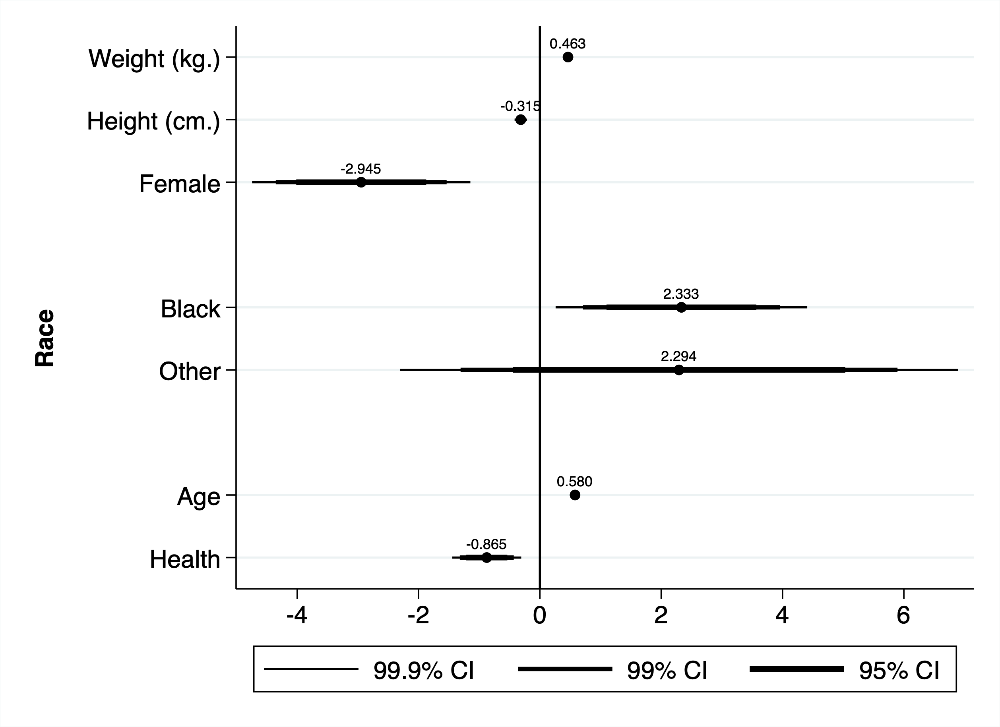
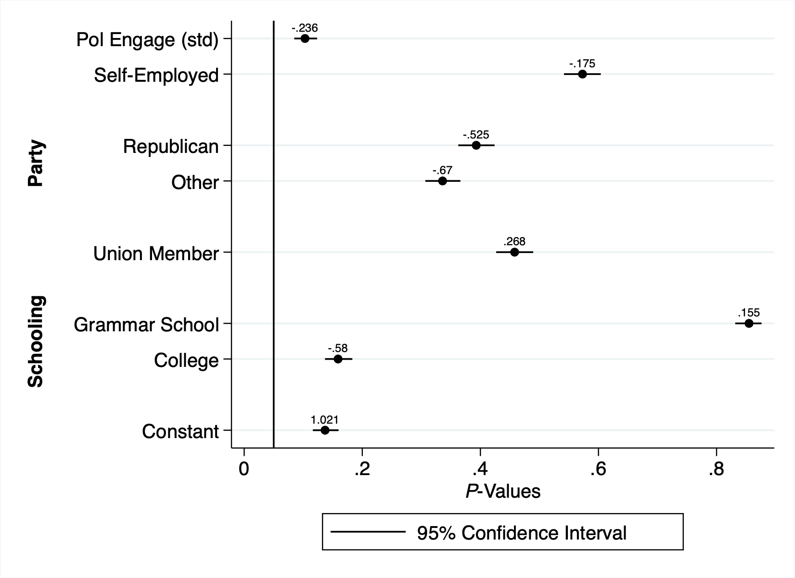
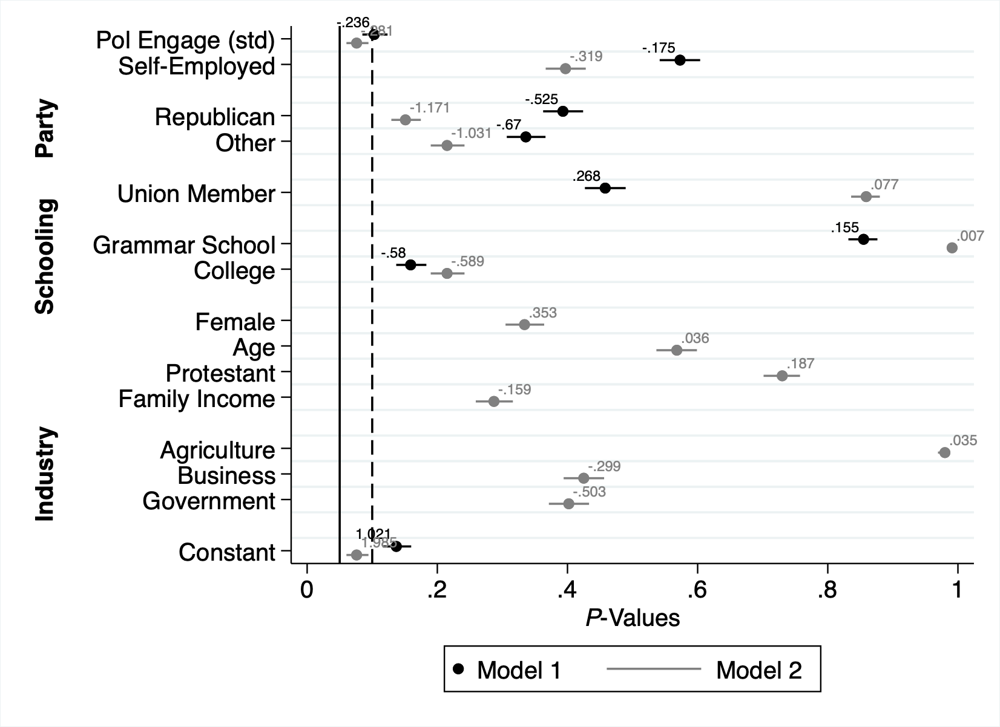
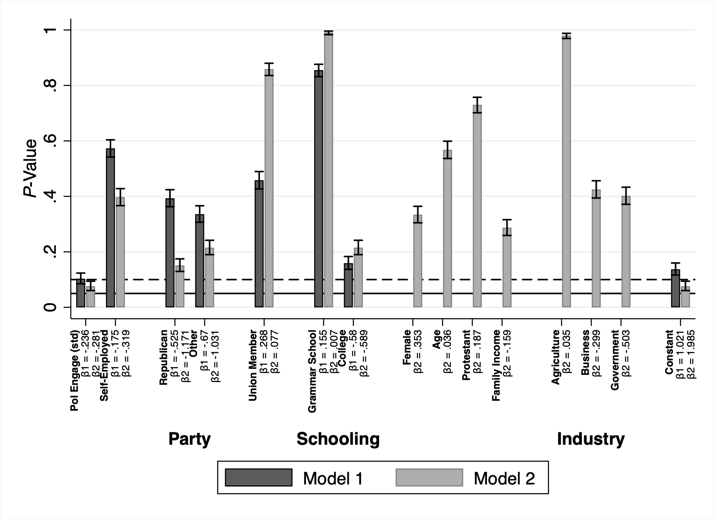
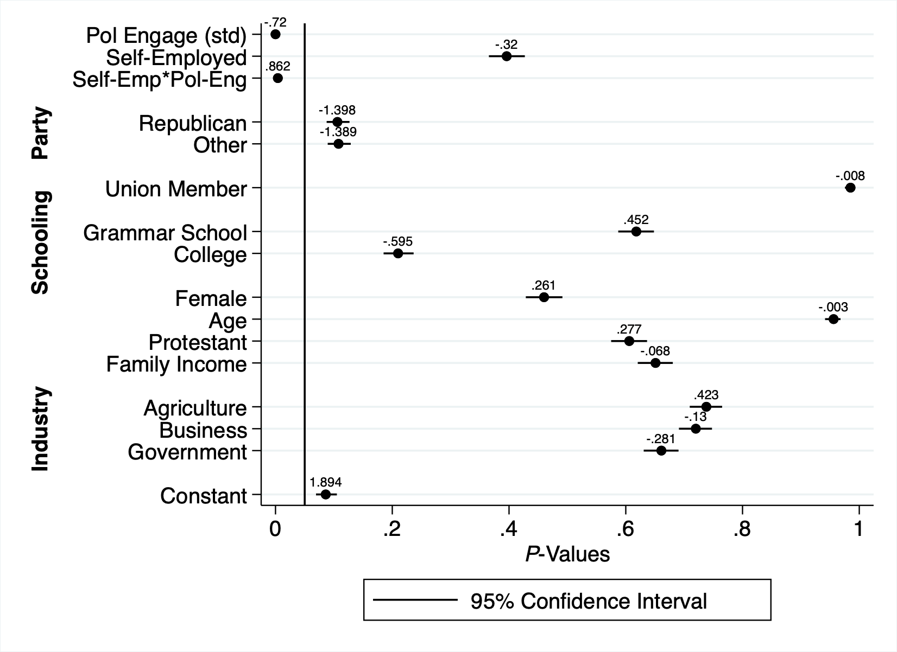
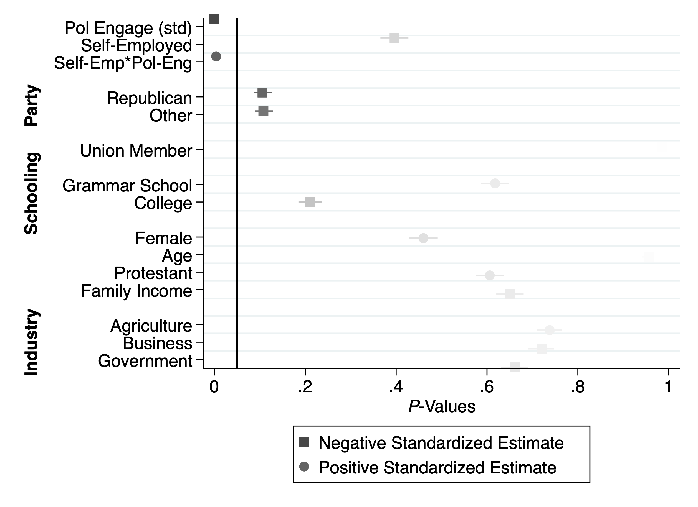
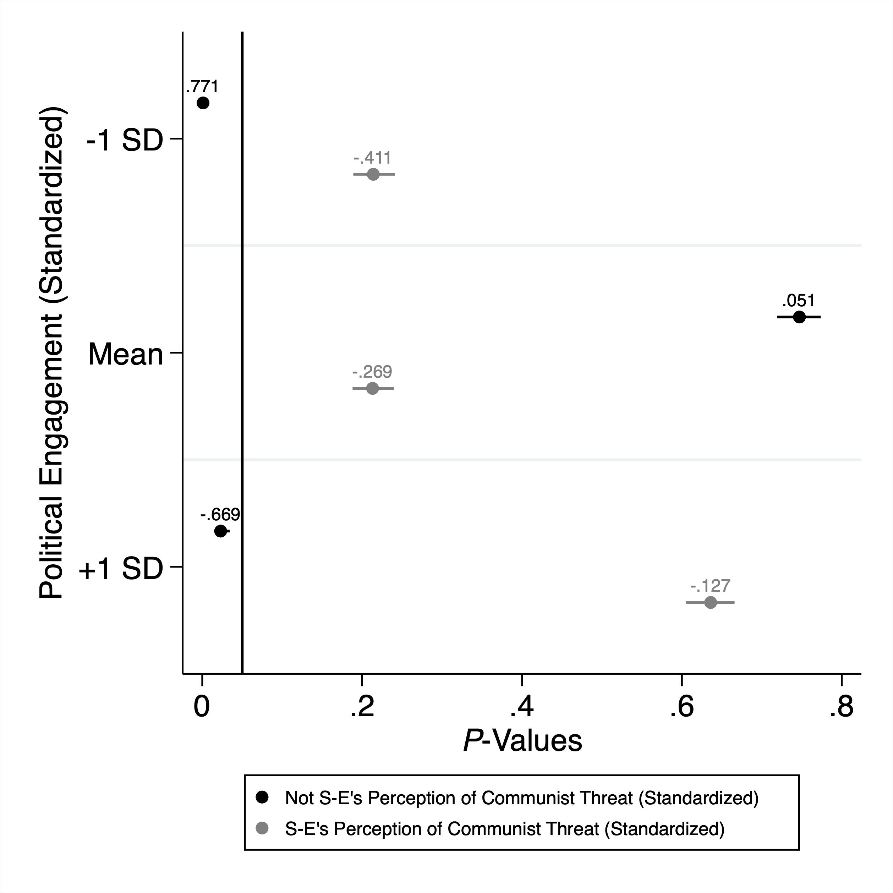
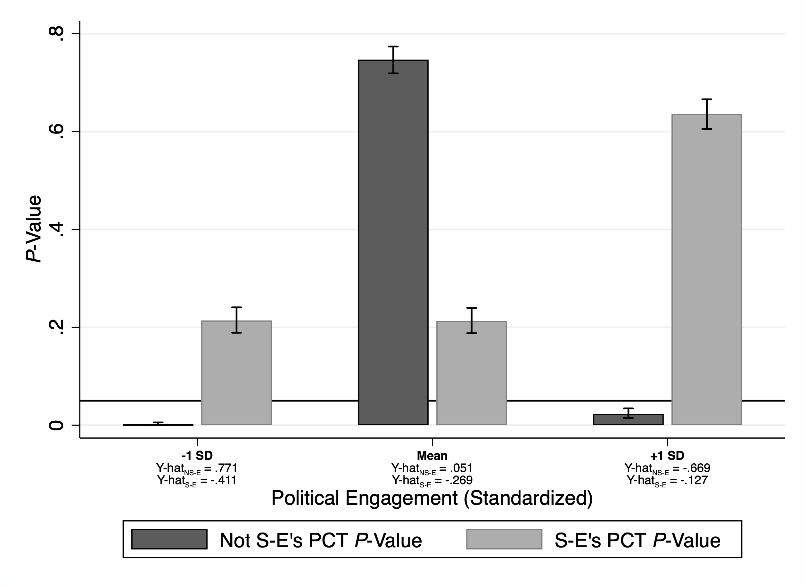
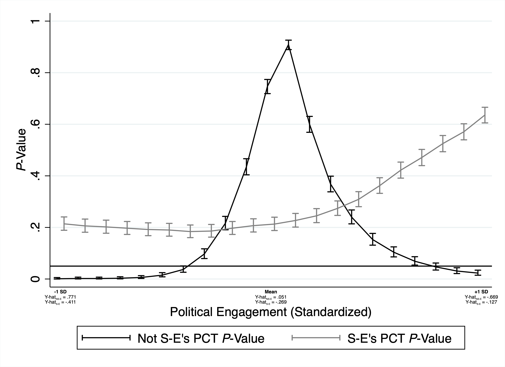

# Replication Repository for "Visualizing Strategies for Regression Estimates with Randomization Inference"
[Marshall A. Taylor](https://www.marshalltaylor.net)

Forthcoming in the *Stata Journal*

# Setup

First, set some parameters

	version 13.1
	clear all
	macro drop _all
	set more off

# Data

Now load up the data. Data come from ICPSR #07273, ["America's Radical Right, 1962,"](https://www.icpsr.umich.edu/icpsrweb/ICPSR/studies/7273/summary) collected by Raymond E. Wolfinger et al. You can name the .dta file whatever you want. You will need to obtain the data directly from ICPSR.

	use rright_repo.dta, clear

# Data Preparation

## Re-Labeling

Now let's give the variables some descriptive labels.

		//Communist danger
	gen cdanger = .
	replace cdanger = 0 if v7==5 | v7==4 | v7==3
	replace cdanger = 1 if v7==1 | v7==2
	label def cdanger 0 "some/little danger" 1 "very great/great danger"
	label var cdanger "Communist danger at present time?"
	label values cdanger cdanger
		//Letter-writing
	gen letter = .
	replace letter = 0 if v13==4
	replace letter = 1 if v13==2
	label def noyes 0 "no" 1 "yes"
	label var letter "Written to politician in last year?"
	label values letter noyes
		//Partisan affiliation
	gen party = .
	replace party = 0 if v9==4
	replace party = 1 if v9==2
	replace party = 2 if v9==6 | party==8
	label def party 0 "dem" 1 "rep" 2 "other"
	label var party "partisan affiliation"
	label values party party
		//Fight Russia?
	gen russia = .
	replace russia = 0 if v8==1 | v8==2 | v8==4 | v8==8
	replace russia = 1 if v8==6
	label var russia "Fight Russia?"
	label values russia noyes
		//Attend political meetings?
	gen meeting = .
	replace meeting = 0 if v16==4
	replace meeting = 1 if v16==2
	label var meeting "Attend political meetings?"
	label values meeting noyes
		//Belong to political organization?
	gen org = .
	replace org = 0 if v18==4
	replace org = 1 if v18==2
	label var org "Belong to political org?"
	label values org noyes
		//Public officials care about your opinion?
	gen popinion = .
	replace popinion = 0 if v36==2
	replace popinion = 1 if v36==4
	label def popinion 0 "don't care" 1 "care"
	label var popinion "Public officials care about your op?"
	label values popinion popinion
		//Should Socialist P publish in US during peacetime?
	gen snews = .
	replace snews = 0 if v37==2
	replace snews = 1 if v37==4
	label var snews "Should Socialist P publish in US during peacetime?"
	label values snews noyes
		//Do Communist professors in US have much influence?
	gen profess = .
	replace profess = 0 if v38==2
	replace profess = 1 if v38==4
	label var profess "Do Communist professors in US have much influence?"
	label values profess noyes
		//Do Communists have a lot of influence in the D Party?
	gen cdems = .
	replace cdems = 0 if v40==2
	replace cdems = 1 if v40==4
	label var cdems "Do Communists have a lot of influence in the D Party?"
	label values cdems noyes
		//Free speech for Communists on US radio/TV?
	gen cspeech = .
	replace cspeech = 0 if v42==4
	replace cspeech = 1 if v42==2
	label var cspeech "Free speech for Communists on US radio/TV?"
	label values cspeech noyes
		//Communists in my your neighborhood?
	gen cneighbor = .
	replace cneighbor = 0 if v43==4
	replace cneighbor = 1 if v43==2
	label var cneighbor "Communists in my your neighborhood?"
	label values cneighbor noyes
		//Local communists more dangerous than Russian or China?
	gen clocal = .
	replace clocal = 0 if v50==2
	replace clocal = 1 if v50==4
	label var clocal "Local communists more dangerous than Russian or China?"
	label values clocal noyes
		//Sex
	gen sex = .
	replace sex = 0 if v54==2
	replace sex = 1 if v54==4
	label def sex 0 "male" 1 "female"
	label var sex "sex of R"
	label values sex sex
		//Age
	gen age=v55
	recode age (00=10)(10=11)(99=.)
	label def age 01 "20-24" 11 "70+"
	label var age "age of R"
	label values age age
		//Schooling
	gen school=v56
	recode school (1=1)(2=1)(3=2)(4=2)(5=3)(6=3)(else=.)
	label def school 1 "some/complete grammar school" 2 "some/complete HS" ///
		3 "some/complete college"
	label var school "How much schooling did you complete?"
	label values school school
		//Union member?
	gen union = .
	replace union = 0 if v61==4
	replace union = 1 if v61==2
	label var union "Union member?"
	label values union noyes
		//Religion
	gen relig = .
	replace relig = 0 if v68==0
	replace relig = 1 if v68==2
	replace relig = 2 if v68==4
	replace relig = 3 if v68==6
	replace relig = 4 if v68==8
	label def relig 0 "none" 1 "protestant" 2 "catholic" 3 "jewish" 4 "other"
	label var relig "R's religion"
	label values relig relig
		//Protestant
	gen relig2 = .
	replace relig2 = 0 if v68==0
	replace relig2 = 1 if v68==2
	replace relig2 = 0 if v68==4
	replace relig2 = 0 if v68==6
	replace relig2 = 0 if v68==8
	label def relig2 0 "other" 1 "protestant" 
	label var relig2 "Is R Protestant"
	label values relig2 relig2
		//Income
	gen income=v72
	recode income (2=1)(4=2)(6=3)(8=4)(0=5)(else=.)
	label def income 1 "under $4,000" 5 "$15,000 and over"
	label var income "Total fam income in previous year bef taxes"
	label values income income
		//Industry
	gen industry=v58
	recode industry (1=1)(2=2)(3=2)(4=2)(5=2)(6=2)(7=3)(8=3)(9=3)(0=4)(else=.)
	label def industry 1 "agriculture" 2 "business" 3 "servivice" 4 "government"
	label var industry "head of house industry"
	label values industry industry
		//Influence vote?
	gen influence = .
	replace influence = 0 if v14==4
	replace influence = 1 if v14==2
	label var influence "Do you try to influence vote?"
	label values influence noyes
		//Give money/buy tickets?
	gen money = .
	replace money = 0 if v15==4
	replace money = 1 if v15==2
	label var money "Do you give money/buy tickets for campaigns?"
	label values money noyes
		//Do work for party/candidate?
	gen work = .
	replace work = 0 if v17==4
	replace work = 1 if v17==2
	label var work "Do you do any other work for party/cand?"
	label values work noyes
		//Employer
	gen selfemp = .
	replace selfemp = 0 if v57==4 | v57==6 | v57==8
	replace selfemp = 1 if v57==2
	label def selfemp 0 "not self-employed" 1 "self-employed"
	label var selfemp "Is R's head of house self-employed?"
	label values selfemp selfemp

## PCA

Now create the PCA variables.

		//Communist threat
	qui reg cdanger profess cdems cspeech cneighbor clocal
	gen flag = e(sample)
	univar cdanger profess cdems cspeech cneighbor clocal if flag==1
	mat define mean = (0.92, 0.88, 0.67, 0.18, 0.51, 0.71)
	mat define sd = (0.27, 0.33, 0.47, 0.39, 0.50, 0.46)
	mat colnames mean = cdanger profess cdems cspeech cneighbor clocal
	mat colnames sd = cdanger profess cdems cspeech cneighbor clocal
	polychoric cdanger profess cdems cspeech cneighbor clocal if flag==1
	global N = r(sum_w)
	matrix r = r(R)
	factormat r, n(${N}) factors(2) means(mean) sds(sd)
	rotate
	predict threat
		//Political engagement
	qui reg meeting letter org influence money work
	gen flag2 = e(sample)
	univar meeting letter org influence money work if flag2==1
	mat define mean2 = (0.61, 0.61, 0.28, 0.92, 0.63, 0.39)
	mat define sd2 = (0.49, 0.49, 0.45, 0.28, 0.48, 0.49)
	mat colnames mean2 = meeting letter org influence money work
	mat colnames sd2 = meeting letter org influence money work
	polychoric meeting letter org influence money work if flag2==1
	global N = r(sum_w)
	matrix r = r(R)
	factormat r, n(${N}) factors(2) means(mean2) sds(sd2)
	rotate
	predict engage
	
# The Models and Their Figures

We're going to use a combination of Stata's [`permute`](https://www.stata.com/manuals13/rpermute.pdf) and Ben Jann's [`coefplot`](https://journals.sagepub.com/doi/abs/10.1177/1536867X1401400402) packages to carry out the analyses and visualizations.

Now we'll generate the models and associated PPV plots (but a coefficient plot for plot #1).

## Plot #1

	save "rright_repo.dta", replace
	clear
	webuse nhanes2f
	reg bpsystol weight height i.sex i.race age health
	est store m1
	coefplot m1, ///
		mlabcolor(black) ///
			xline(0, lcolor(black)) mcol(black) msize(small) mlabsize(2) ///
			graphregion(fcolor(white) lcolor(white) lwidth(thick)) drop(_cons) ///
			coeflabels(weight="Weight (kg.)" height="Height (cm.)" 2.sex="Female" ///
			2.race="Black" 3.race="Other" age="Age" health="Health") ///
			groups(?.race ?.race = "{bf:Race}") mlabels(weight=12 "0.463" height=12 "-0.315" ///
			2.sex=12 "-2.945" 2.race=12 "2.333" 3.race=12 "2.294" age=12 "0.580" ///
			health=12 "-0.865") levels(99.9 99 95) legend(order(1 "99.9% CI" 2 ///
			"99% CI" 3 "95% CI") rows(1)) ciopts(lcolor(black black black)) ///
			saving(ex1plot.gph, replace)
	graph export ex1plot.png, replace
	clear
	use "rright_repo.dta"
	

## Plot #2

	qui reg threat engage i.party i.sex age ib2.school i.union i.relig income ///
		i.industry i.selfemp
	gen flag3 = e(sample)
	egen threat2 = std(threat) if flag3==1
	egen engage2 = std(engage) if flag3==1
	mat p_model = J(12, 3, .)
	qui reg threat2 engage2 i.party i.union ib2.school i.selfemp if flag3==1
	mat def beta = e(b)
	forvalues k = 1/12 {
		global k`k' = round(beta[1,`k'], .001)
		}
	permute threat2 _b, reps(1000) seed(5): ///
		qui reg threat2 engage2 i.party i.union ib2.school i.selfemp if flag3==1
	mat def m1 = r(p)
	mat def m12 = r(ci)
	forvalues k = 1/12 {
		mat p_model[`k',1] = m1[1,`k']
		mat p_model[`k',2] = m12[1,`k']
		mat p_model[`k',3] = m12[2,`k']
		}
	mat rownames p_model = engage2 0.party 1.party 2.party 0.union 1.union ///
		1.school 2.school 3.school 0.selfemp 1.selfemp constant
	coefplot (matrix(p_model[,1]), ci((p_model[,2] p_model[,3]))), ///
		mlabels(engage2=12 ${k1} 1.party=12 ${k3} 2.party=12 ${k4} 1.union=12 ${k6} ///
			1.school=12 ${k7} 3.school=12 ${k9} 1.selfemp=12 ${k11} constant=12 ${k12}) mlabcolor(black) ///
			xline(0.05, lcolor(black)) mcol(black) msize(small) mlabsize(2) ///
			graphregion(fcolor(white) lcolor(white) lwidth(thick)) drop(0.party 0.union 2.school 0.selfemp) ///
			coeflabels(engage2="Pol Engage (std)" 1.party="Republican" ///
			2.party="Other" 1.union="Union Member" 1.school="Grammar School" ///
			3.school="College" 1.selfemp="Self-Employed" constant="Constant") legend(order(1 "95% Confidence Interval")) ///
			ciopts(lcolor(black)) groups(1.party 2.party = "{bf:Party}" ///
			1.school 3.school="{bf:Schooling}") xtitle("{it:P}-Values") ///
			order(engage2 ?.selfemp ?.party ?.union ?.school constant) ///
			saving(ex2plot.gph, replace)
	graph export ex2plot.png, replace

## Plot #3

	mat p_model2 = J(22, 3, .)
	qui reg threat2 engage2 i.party i.union ib2.school i.sex age i.relig2 income ///
		ib3.industry i.selfemp if flag3==1
	mat def beta2 = e(b)
	forvalues i = 1/22 {
		global i`i' = round(beta2[1,`i'], .001)
		}
	permute threat2 _b, reps(1000) seed(5): ///
	qui reg threat2 engage2 i.party i.union ib2.school i.sex age i.relig2 income ///
		ib3.industry i.selfemp if flag3==1
	mat def mm1 = r(p)
	mat def mm12 = r(ci)
	forvalues i = 1/22 {
		mat p_model2[`i',1] = mm1[1,`i']
		mat p_model2[`i',2] = mm12[1,`i']
		mat p_model2[`i',3] = mm12[2,`i']
		}
	mat rownames p_model2 = engage2 0.party 1.party 2.party 0.union 1.union ///
		1.school 2.school 3.school 0.sex 1.sex age 0.relig2 1.relig2 income 1.industry ///
		2.industry 3.industry 4.industry 0.selfemp 1.selfemp constant
	coefplot (matrix(p_model[,1]), mlabels(engage2=11 ${k1} 1.party=11 ${k3} ///
		2.party=11 ${k4} 1.union=11 ${k6} 1.school=11 ${k7} 3.school=11 ${k9} ///
		constant=11 ${k12} 1.selfemp=11 ${k11}) mlabcolor(black) xline(0.05, lcolor(black)) ///
		xline(0.1, lcolor(black) lpattern(dash)) mcol(black) ///
		msize(small) mlabsize(2) ci((p_model[,2] p_model[,3])) ciopts(lcolor(black))) ///
		(matrix(p_model2[,1]), mlabels(engage2=1 ${i1} 1.party=1 ${i3} ///
		2.party=1 ${i4} 1.union=1 ${i6} 1.school=1 ${i7} 3.school=1 ${i9} ///
		1.sex=1 ${i11} age=1 ${i12} 1.relig2=1 ${i14} income=1 ${i15} ///
		1.industry=1 ${i16} 2.industry=1 ${i17} 4.industry=1 ${i19} constant=1 ${i22} ///
		1.selfemp=1 ${i21}) mlabcolor(gray) mcol(gray) msize(small) mlabsize(2) ///
		ci((p_model2[,2] p_model2[,3])) ciopts(lcolor(gray))), graphregion(fcolor(white) lcolor(white) ///
		lwidth(thick)) drop(0.party 0.union 0.sex 0.relig2 2.school 3.industry 0.selfemp) ///
		coeflabels(engage2="Pol Engage (std)" 1.party="Republican" 2.party="Other" ///
		1.union="Union Member" 1.school="Grammar School" 3.school="College" ///
		1.sex="Female" age="Age" 1.relig2="Protestant" income="Family Income" ///
		1.industry="Agriculture" 2.industry="Business" 4.industry="Government" constant="Constant" ///
		1.selfemp="Self-Employed") groups(1.party 2.party = "{bf:Party}" 1.school 3.school = "{bf:Schooling}" ///
		1.industry 2.industry 4.industry = "{bf:Industry}") ///
		legend(order(2 "Model 1" 3 "Model 2")) xtitle("{it:P}-Values") ///
		order(engage2 ?.selfemp ?.party ?.union ?.school ?.sex age ?.relig2 income ?.industry ///
		constant) saving(ex3plot.gph, replace)
	graph export ex3plot.png, replace
		

## Plot #4

	#delimit ;
	coefplot (matrix(p_model[,1]), ci((p_model[,2] p_model[,3])) bcolor(black)) 
		(matrix(p_model2[,1]), ci((p_model2[,2] p_model2[,3])) bcolor(gray)), 
		graphregion(fcolor(white) lcolor(white) lwidth(thick)) drop(0.party 0.union 
		0.sex 0.relig2 2.school 3.industry 0.selfemp) coeflabels(
		engage2=`""{bf:Pol Engage (std)}" "{&beta}1 = ${k1}" "{&beta}2 = ${i1}""'
		1.party=`""{bf:Republican}" "{&beta}1 = ${k3}" "{&beta}2 = ${i3}""'
		2.party=`""{bf:Other}" "{&beta}1 = ${k4}" "{&beta}2 = ${i4}""'
		1.union=`""{bf:Union Member}" "{&beta}1 = ${k6}" "{&beta}2 = ${i6}""'
		1.school=`""{bf:Grammar School}" "{&beta}1 = ${k7}" "{&beta}2 = ${i7}""'
		3.school=`""{bf:College}" "{&beta}1 = ${k9}" "{&beta}2 = ${i9}""'
		1.sex=`""{bf:Female}" "{&beta}2 = ${i11}"'
		age=`""{bf:Age}" "{&beta}2 = ${i12}"'
		1.relig2=`""{bf:Protestant}" "{&beta}2 = ${i14}"'
		income=`""{bf:Family Income}" "{&beta}2 = ${i15}"'
		1.industry=`""{bf:Agriculture}" "{&beta}2 = ${i16}"'
		2.industry=`""{bf:Business}" "{&beta}2 = ${i17}"'
		4.industry=`""{bf:Government}" "{&beta}2 = ${i19}"'
		1.selfemp=`""{bf:Self-Employed}" "{&beta}1 = ${k11}" "{&beta}2 = ${i21}"'
		constant=`""{bf:Constant}" "{&beta}1 = ${k12}" "{&beta}2 = ${i22}"', labsize(vsmall) angle(90))
		groups(1.party 2.party = "{bf:Party}" 1.school 3.school = "{bf:Schooling}"
		1.industry 2.industry 4.industry = "{bf:Industry}") order(engage2 ?.selfemp ?.party 
		?.union ?.school ?.sex age ?.relig2 income ?.industry constant)
		ciopts(lcolor(black) recast(rcap rcap))
		recast(bar) vertical yline(0.05, lcolor(black)) yline(0.1, lcolor(black) lpattern(dash))
		ytitle("{it:P}-Value") barwidth(.3) fcolor(*.8) citop xlabel(, labsize(vsmall)
		angle(90)) legend(order(1 "Model 1" 3 "Model 2")) saving(ex4plot.gph, replace) ;
	#delimit cr
	graph export ex4plot.png, replace

## Plot #5

### Plot #5a

	mat p_model3 = J(24, 3, .)
	qui reg threat2 c.engage2##i.selfemp i.party i.union ib2.school i.sex age i.relig2 c.income ///
		ib3.industry if flag3==1
	mat def beta2 = e(b)
	forvalues i = 1/24 {
		global n`i' = round(beta2[1,`i'], .001)
		}
	permute threat2 _b, reps(1000) seed(5): ///
	qui reg threat2 c.engage2##i.selfemp i.party i.union ib2.school i.sex age i.relig2 c.income ///
		ib3.industry if flag3==1
	mat def mm1 = r(p)
	mat def mm12 = r(ci)
	forvalues i = 1/24 {
		mat p_model3[`i',1] = mm1[1,`i']
		mat p_model3[`i',2] = mm12[1,`i']
		mat p_model3[`i',3] = mm12[2,`i']
		}
	mat rownames p_model3 = engage2 0.selfemp 1.selfemp 0.selfemp#c.engage2 ///
		1.selfemp#c.engage2 0.party 1.party 2.party 0.union 1.union ///
		1.school 2.school 3.school 0.sex 1.sex age 0.relig2 1.relig2 income ///
		1.industry 2.industry 3.industry 4.industry constant
	coefplot (matrix(p_model3[,1]), mlabels(engage2=12 ${n1} 1.selfemp=12 ${n3} ///
		1.selfemp#c.engage2=12 ${n5} 1.party=12 ${n7} ///
		2.party=12 ${n8} 1.union=12 ${n10} 1.school=12 ${n11} 3.school=12 ${n13} ///
		1.sex=12 ${n15} age=12 ${n16} 1.relig2=12 ${n18} income=12 ${n19} ///
		1.industry=12 ${n20} 2.industry=12 ${n21} 4.industry=12 ${n23} constant=12 ${n24}) ///
		mlabcolor(black) mcol(black) msize(small) mlabsize(2) xline(0.05, lcolor(black)) ///
		ci((p_model3[,2] p_model3[,3])) ciopts(lcolor(black))), graphregion(fcolor(white) ///
		lcolor(white) lwidth(thick)) drop(0.selfemp 0.party 0.union 0.relig2 2.school 0.sex ///
		0.selfemp#c.engage2 3.industry) ///
		coeflabels(engage2="Pol Engage (std)" 1.selfemp="Self-Employed" ///
		1.selfemp#c.engage2="Self-Emp*Pol-Eng" 1.party="Republican" 2.party="Other" ///
		1.union="Union Member" 1.school="Grammar School" 3.school="College" ///
		1.sex="Female" age="Age" 1.relig2="Protestant" income="Family Income" ///
		1.industry="Agriculture" 2.industry="Business" 4.industry="Government" ///
		constant="Constant") groups(1.party 2.party = "{bf:Party}" 1.school ///
		3.school = "{bf:Schooling}" 1.industry 2.industry 4.industry = "{bf:Industry}") ///
		legend(order(1 "95% Confidence Interval")) xtitle("{it:P}-Values") ///
		order(engage2 ?.selfemp 1.selfemp#c.engage2 ?.party ?.union ?.school ?.sex ///
		age ?.relig2 income ?.industry constant) saving(ex51plot.gph, replace)
	graph export ex51plot.png, replace
	

### Plot #5b

	mat p_model3 = J(24, 3, .)
	permute threat2 _b, reps(1000) seed(5): ///
	qui reg threat2 c.engage2##i.selfemp i.party i.union ib2.school i.sex age i.relig2 c.income ///
		ib3.industry if flag3==1
	mat def mm1 = r(p)
	mat def mm12 = r(ci)
	forvalues i = 1/24 {
		mat p_model3[`i',1] = mm1[1,`i']
		mat p_model3[`i',2] = mm12[1,`i']
		mat p_model3[`i',3] = mm12[2,`i']
		}
	mat rownames p_model3 = engage2 0.selfemp 1.selfemp 0.selfemp#c.engage2 ///
		1.selfemp#c.engage2 0.party 1.party 2.party 0.union 1.union ///
		1.school 2.school 3.school 0.sex 1.sex age 0.relig2 1.relig2 income ///
		1.industry 2.industry 3.industry 4.industry constant
	qui reg threat2 c.engage2##i.selfemp i.party i.union ib2.school i.sex age i.relig2 c.income ///
		ib3.industry if flag3==1, b
	qui listcoef
	mat list r(table)
	#delimit ;	
	coefplot 
		(matrix(p_model3[,1]), keep(engage2)
		mcol(black*.72) msymbol(square) xline(0.05, lcolor(black))
		ci((p_model3[,2] p_model3[,3])) ciopts(lcolor(black*.72))) 
		(matrix(p_model3[,1]), keep(1.selfemp)
		mcol(black*.16) msymbol(square) xline(0.05, lcolor(black))
		ci((p_model3[,2] p_model3[,3])) ciopts(lcolor(black*.16)))
		(matrix(p_model3[,1]), keep(1.selfemp#c.engage2)
		mcol(black*.61) xline(0.05, lcolor(black))
		ci((p_model3[,2] p_model3[,3])) ciopts(lcolor(black*.61)))
		(matrix(p_model3[,1]), keep(1.party)
		mcol(black*.60) msymbol(square) xline(0.05, lcolor(black))
		ci((p_model3[,2] p_model3[,3])) ciopts(lcolor(black*.60)))
		(matrix(p_model3[,1]), keep(2.party) 
		mcol(black*.54) msymbol(square) xline(0.05, lcolor(black))
		ci((p_model3[,2] p_model3[,3])) ciopts(lcolor(black*.54)))
		(matrix(p_model3[,1]), keep(1.union)
		mcol(black*.003) msymbol(square) xline(0.05, lcolor(black))
		ci((p_model3[,2] p_model3[,3])) ciopts(lcolor(black*.003)))
		(matrix(p_model3[,1]), keep(1.school)
		mcol(black*.08) xline(0.05, lcolor(black))
		ci((p_model3[,2] p_model3[,3])) ciopts(lcolor(black*.08)))
		(matrix(p_model3[,1]), keep(3.school)
		mcol(black*.23) msymbol(square) xline(0.05, lcolor(black))
		ci((p_model3[,2] p_model3[,3])) ciopts(lcolor(black*.23)))
		(matrix(p_model3[,1]), keep(1.sex) 
		mcol(black*.12) xline(0.05, lcolor(black))
		ci((p_model3[,2] p_model3[,3])) ciopts(lcolor(black*.12)))
		(matrix(p_model3[,1]), keep(age) 
		mcol(black*.01) msymbol(square) xline(0.05, lcolor(black))
		ci((p_model3[,2] p_model3[,3])) ciopts(lcolor(black*.01)))
		(matrix(p_model3[,1]), keep(1.relig2) 
		mcol(black*.10) xline(0.05, lcolor(black))
		ci((p_model3[,2] p_model3[,3])) ciopts(lcolor(black*.10)))
		(matrix(p_model3[,1]), keep(income)
		mcol(black*.08) msymbol(square) xline(0.05, lcolor(black))
		ci((p_model3[,2] p_model3[,3])) ciopts(lcolor(black*.08)))
		(matrix(p_model3[,1]), keep(1.industry) 
		mcol(black*.06) xline(0.05, lcolor(black))
		ci((p_model3[,2] p_model3[,3])) ciopts(lcolor(black*.06)))
		(matrix(p_model3[,1]), keep(2.industry)
		mcol(black*.06) msymbol(square) xline(0.05, lcolor(black))
		ci((p_model3[,2] p_model3[,3])) ciopts(lcolor(black*.06)))
		(matrix(p_model3[,1]), keep(4.industry)
		mcol(black*.10) msymbol(square) xline(0.05, lcolor(black))
		ci((p_model3[,2] p_model3[,3])) ciopts(lcolor(black*.10))),
		graphregion(fcolor(white) lcolor(white) lwidth(thick))
		coeflabels(engage2="Pol Engage (std)" 1.selfemp="Self-Employed"
		1.selfemp#c.engage2="Self-Emp*Pol-Eng" 1.party="Republican" 2.party="Other"
		1.union="Union Member" 1.school="Grammar School" 3.school="College"
		1.sex="Female" age="Age" 1.relig2="Protestant" income="Family Income"
		1.industry="Agriculture" 2.industry="Business" 4.industry="Government") 
		groups(1.party 2.party = "{bf:Party}" 1.school
		3.school = "{bf:Schooling}" 1.industry 2.industry 4.industry = "{bf:Industry}")
		legend(order(2 "Negative Standardized Estimate" 6 "Positive Standardized Estimate")
		cols(1)) 
		xtitle("{it:P}-Values")
		order(engage2 ?.selfemp 1.selfemp#c.engage2 ?.party ?.union ?.school ?.sex 
		age ?.relig2 income ?.industry) saving(ex52plot.gph, replace) ;
	#delimit cr	
	graph export ex52plot.png, replace
	

## Plot #6

	qui reg threat2 c.engage2##i.selfemp i.party i.union ib2.school i.sex age i.relig2 c.income ///
		ib3.industry if flag3==1
	program define permtest
	version 13.1
	qui reg threat2 i.selfemp##c.engage2 i.party i.union ib2.school i.sex age i.relig2 c.income ///
		ib3.industry if flag3==1
	margins, at(engage2=(-1 0 1) selfemp=(0 1)) asobserved post
	end
	permute threat2 _b, reps(1000) seed(5): permtest if flag3==1
	mat predm = J(3, 3, .)
	mat predf = J(3, 3, .)
	qui permtest
	mat def pred_beta = e(b)
	mat pred_betam = pred_beta[1,1..3]
	mat defin pred_betaf = pred_beta[1,4..6]
	forvalues m = 1/3 {
		global m`m' = round(pred_betam[1,`m'], .001)
		}
	forvalues f = 1/3 {
		global f`f' = round(pred_betaf[1,`f'], .001)
		}
	permute threat2 _b, reps(1000) seed(5): permtest if flag3==1
	mat def pm1 = r(p)
	mat def pm12 = r(ci)
	mat pm1m = pm1[1,1..3]
	mat pm12m = pm12[1..2,1..3]
	mat pm1f = pm1[1,4..6]
	mat pm12f = pm12[1..2,4..6]
	forvalues m = 1/3 {
		mat predm[`m',1] = pm1m[1,`m']
		mat predm[`m',2] = pm12m[1,`m']
		mat predm[`m',3] = pm12m[2,`m']
		}
	forvalues f = 1/3 {
		mat predf[`f',1] = pm1f[1,`f']
		mat predf[`f',2] = pm12f[1,`f']
		mat predf[`f',3] = pm12f[2,`f']
		}
	coefplot (matrix(predm[,1]), mlabels(r1=12 ${m1} r2=12 ${m2} r3=12 ${m3}) ///
		mlabcolor(black) xline(0.05, lcolor(black)) mcol(black) msize(small) ///
		mlabsize(2) ci((predm[,2] predm[,3])) ciopts(lcolor(black))) ///
		(matrix(predf[,1]), mlabels(r1=12 ${f1} r2=12 ${f2} r3=12 ${f3}) ///
		mlabcolor(gray) mcol(gray) msize(small) mlabsize(2) ///
		ci((predf[,2] predf[,3])) ciopts(lcolor(gray))), graphregion(fcolor(white) ///
		lcolor(white) lwidth(thick)) coeflabels(r1="-1 SD" r2="Mean" ///
		r3="+1 SD") legend(order(2 "Not S-E's Perception of Communist Threat (Standardized)" ///
		4 "S-E's Perception of Communist Threat (Standardized)") cols(1) size(vsmall)) ///
		xtitle("{it:P}-Values") xsize(1) ysize(1) ///
		ytitle("Political Engagement (Standardized)") saving(ex6plot.gph, replace)
	graph export ex6plot.png, replace
	

## Plot #7

	#delimit ;
	coefplot (matrix(predm[,1]), ci((predm[,2] predm[,3])) bcolor(black))
		(matrix(predf[,1]), ci((predf[,2] predf[,3])) bcolor(gray)),
		graphregion(fcolor(white) lcolor(white) lwidth(thick)) coeflabels(
		r1=`""{bf:-1 SD}" "Y-hat{subscript:NS-E} = ${m1}" "Y-hat{subscript:S-E} = ${f1}""' 
		r2=`""{bf:Mean}" "Y-hat{subscript:NS-E} = ${m2}" "Y-hat{subscript:S-E} = ${f2}""' 
		r3=`""{bf:+1 SD}" "Y-hat{subscript:NS-E} = ${m3}" "Y-hat{subscript:S-E} = ${f3}""')
		ciopts(lcolor(black) recast(rcap rcap))
		recast(bar) vertical
		ytitle("{it:P}-Value") barwidth(.3) fcolor(*.8) citop xlabel(,
		labsize(vsmall)) yline (0.05, lcolor(black)) legend(order(1 "Not S-E's PCT {it:P}-Value"
		3 "S-E's PCT {it:P}-Value")) 
		xtitle("Political Engagement (Standardized)") saving(ex7plot.gph, replace) ;
	#delimit cr
	graph export ex7plot.png, replace
	

## Plot #8

	program define permtest2
	version 13.1
	qui reg threat2 i.selfemp##c.engage2 i.party i.union ib2.school i.sex age i.relig2 c.income ///
		ib3.industry if flag3==1
	margins, at(engage2=(-1(.1)1) selfemp=(0 1)) asobserved post
	end
	mat predm2 = J(21, 3, .)
	mat predf2 = J(21, 3, .)
	qui permtest2
	mat def pred_beta2 = e(b)
	mat pred_betam2 = pred_beta2[1,1..21]
	mat defin pred_betaf2 = pred_beta2[1,22..42]
	forvalues m = 1/21 {
		global m`m' = round(pred_betam2[1,`m'], .001)
		}
	forvalues f = 1/21 {
		global f`f' = round(pred_betaf2[1,`f'], .001)
		}
	permute threat2 _b, reps(1000) seed(5): permtest2 if flag3==1
	mat def pm1b = r(p)
	mat def pm12b = r(ci)
	mat pm1m2 = pm1b[1,1..21]
	mat pm12m2 = pm12b[1..2,1..21]
	mat pm1f2 = pm1b[1,22..42]
	mat pm12f2 = pm12b[1..2,22..42]
	forvalues m = 1/21 {
		mat predm2[`m',1] = pm1m2[1,`m']
		mat predm2[`m',2] = pm12m2[1,`m']
		mat predm2[`m',3] = pm12m2[2,`m']
		}
	forvalues f = 1/21 {
		mat predf2[`f',1] = pm1f2[1,`f']
		mat predf2[`f',2] = pm12f2[1,`f']
		mat predf2[`f',3] = pm12f2[2,`f']
		}
	#delimit ;
	coefplot (matrix(predm2[,1]), ci((predm2[,2] predm2[,3])) lcolor(black) 
		ciopts(lcolor(black) recast(rcap)))
		(matrix(predf2[,1]), ci((predf2[,2] predf2[,3])) lcolor(gray) 
		ciopts(lcolor(gray) recast(rcap))),
		graphregion(fcolor(white) lcolor(white) lwidth(thick)) 
		recast(line) vertical coeflabels(
		r1=`""{bf:-1 SD}" "Y-hat{subscript:NS-E} = ${m1}" "Y-hat{subscript:S-E} = ${f1}""'
		r11=`""{bf:Mean}" "Y-hat{subscript:NS-E} = ${m11}" "Y-hat{subscript:S-E} = ${f11}""'
		r21=`""{bf:+1 SD}" "Y-hat{subscript:NS-E} = ${m21}" "Y-hat{subscript:S-E} = ${f21}""'
		r2=" " r3=" " r4=" " r5=" " r6=" " r7=" " r8=" " r9=" " r10=" " r12=" "
		r13=" " r14=" " r15=" " r16=" " r17=" " r18=" " r19=" " r20=" ")
		ytitle("{it:P}-Value") xtitle("Political Engagement (Standardized)") 
		yline(0.05, lcolor(black)) xlabel(,labsize(tiny) notick) 
		legend(order(1 "Not S-E's PCT {it:P}-Value" 3 "S-E's PCT {it:P}-Value")) 
		saving(ex8plot.gph, replace) ;
	#delimit cr
	graph export ex8plot.png, replace
	

And that's it!

